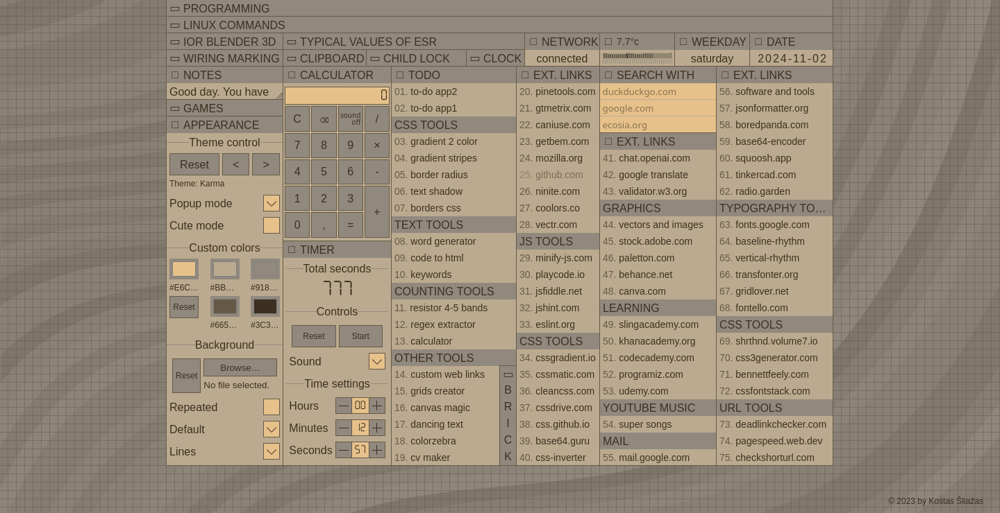
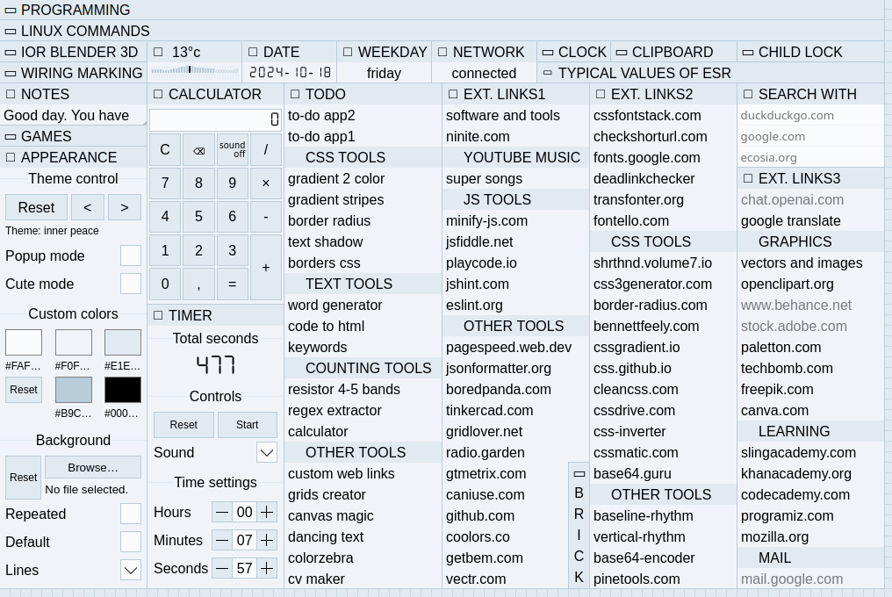

# Project Kitten
This repository contains a collection of web-based tools and applications and links.

[Screenshots](#screenshots) | [Getting Started](#getting-started) | [License](#license)

## Screenshots




## Getting Started

Clone the repository and open the desired project folder. All tools are separate, small projects in the folder named 'tools'. Each tool can be used individually by opening the respective index.html file.

```bash
git clone https://github.com/KostasSliazas/project-k.git
```
## Available tools

| Project Name             | Description                                               | Quick Link                  |
|--------------------------|-----------------------------------------------------------|-----------------------------|
| **border-radius**        | A tool for generating CSS border-radius values.           | [Live Demo](https://kostassliazas.github.io/project-k/tools/border-radius)         |
| **borders-gen**          | A generator for different types of CSS borders.           | [Live Demo](https://kostassliazas.github.io/project-k/tools/borders-gen)           |
| **calculator**           | A simple calculator application for basic arithmetic operations. | [Live Demo](https://kostassliazas.github.io/project-k/tools/calculator)         |
| **canvas-magic**         | A creative canvas tool for drawing and designing.         | [Live Demo](https://kostassliazas.github.io/project-k/tools/canvas-magic)         |
| **code-to-html**         | A utility for converting code snippets into HTML format.  | [Live Demo](https://kostassliazas.github.io/project-k/tools/code-to-html)         |
| **colorzebra**           | A color scheme generator for web design.                  | [Live Demo](https://kostassliazas.github.io/project-k/tools/colorzebra)           |
| **cvmaker**              | A simple tool for creating resumes (CVs).                 | [Live Demo](https://kostassliazas.github.io/project-k/tools/cvmaker)              |
| **dancing-text**         | A fun application that animates text with various effects.| [Live Demo](https://kostassliazas.github.io/project-k/tools/dancing-text)         |
| **gradient-generator**   | A tool for generating beautiful gradients.                | [Live Demo](https://kostassliazas.github.io/project-k/tools/gradient-generator)   |
| **gradients-two-colors** | A simple gradient generator for two colors.               | [Live Demo](https://kostassliazas.github.io/project-k/tools/gradients-two-colors) |
| **grids-creator**        | A utility for creating CSS grid layouts.                  | [Live Demo](https://kostassliazas.github.io/project-k/tools/grids-creator)        |
| **keywords**             | A tool for generating SEO-friendly keywords.              | [Live Demo](https://kostassliazas.github.io/project-k/tools/keywords)             |
| **links**                | A basic link shortener and organizer.                     | [Live Demo](https://kostassliazas.github.io/project-k/tools/links)                |
| **links-webpage**        | A web page for managing and displaying links.             | [Live Demo](https://kostassliazas.github.io/project-k/tools/links-webpage)        |
| **regex-extractor**      | A tool for extracting data using regular expressions.     | [Live Demo](https://kostassliazas.github.io/project-k/tools/regex-extractor)      |
| **resistor-calculator**  | A calculator for determining resistor values.             | [Live Demo](https://kostassliazas.github.io/project-k/tools/resistor-calculator)  |
| **text-shadow**          | A tool for generating CSS text shadows.                   | [Live Demo](https://kostassliazas.github.io/project-k/tools/text-shadow)          |
| **todo-app**             | A simple to-do list application.                          | [Live Demo](https://kostassliazas.github.io/project-k/tools/todo-app)             |
| **todo-app-1**           | An enhanced version of the to-do list application.        | [Live Demo](https://kostassliazas.github.io/project-k/tools/todo-app-1)           |
| **word-generator**       | A tool for generating random words.                       | [Live Demo](https://kostassliazas.github.io/project-k/tools/word-generator)       |


## Available games
| Game Name                | Description                                               | Quick Link                  |
|--------------------------|-----------------------------------------------------------|-----------------------------|
| **Memory Game2**         | A fun memory matching game to improve memory skills.       | [Live Demo](https://kostassliazas.github.io/project-k/games/memory-game)       |
| **Questionnaire**        | A game for answering customizable sets of questions.       | [Live Demo](https://kostassliazas.github.io/project-k/games/questionnaire)     |
| **Roulette**             | A simple roulette game for fun and entertainment.          | [Live Demo](https://kostassliazas.github.io/project-k/games/roulette)          |

## Technologies Used

This project is built using the following technologies:

- **HTML**: For structuring the web applications.
- **CSS**: For styling and layout design.
- **JavaScript(Vanilla)**: For implementing core functionalities without any frameworks.
- **Vue.js**: A progressive JavaScript framework for building user interfaces.

## License

This project is licensed under the MIT License. See the [LICENSE](LICENSE.txt) file for details.

## Disclaimer

Please note that some of the tools included in this project are not originally created by me. They are utilized to enhance functionality and provide additional features. I acknowledge and appreciate the efforts of the original creators of these tools.

Please note that the external links included in this project are not owned or maintained by me. They are used for reference and convenience to enhance the functionality of the tools. I do not take responsibility for the content or availability of these external resources.
