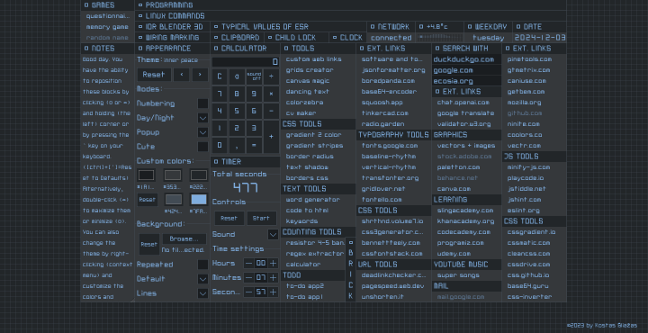

# Project K

Welcome to **Project K**! This repository contains a collection of web-based tools and applications designed to simplify various tasks and enhance productivity for developers and designers. Each tool serves a unique purpose, from generating CSS styles to managing tasks efficiently.

## Project Overview

## Screenshots

Here are some quick screenshots of the tools:



## Getting Started

To get started with any of the projects, clone the repository and open the desired project folder. Each project may have its own README file with specific instructions on how to run or use it.

```bash
git clone https://github.com/KostasSliazas/project-k.git
```

| Project Name             | Description                                               | Quick Link                  |
|--------------------------|-----------------------------------------------------------|-----------------------------|
| **border-radius**        | A tool for generating CSS border-radius values.          | [Live Demo](https://kostassliazas.github.io/project-k/tools/border-radius){:target="_blank" rel="noopener noreferrer"}             |
| **borders-gen**          | A generator for different types of CSS borders.          | [Live Demo](https://kostassliazas.github.io/project-k/tools/borders-gen){:target="_blank" rel="noopener noreferrer"}             |
| **calculator**           | A simple calculator application for basic arithmetic operations. | [Live Demo](https://kostassliazas.github.io/project-k/tools/calculator){:target="_blank" rel="noopener noreferrer"}         |
| **canvas-magic**         | A creative canvas tool for drawing and designing.        | [Live Demo](https://kostassliazas.github.io/project-k/tools/canvas-magic){:target="_blank" rel="noopener noreferrer"}             |
| **code-to-html**         | A utility for converting code snippets into HTML format. | [Live Demo](https://kostassliazas.github.io/project-k/tools/code-to-html){:target="_blank" rel="noopener noreferrer"}             |
| **colorzebra**           | A color scheme generator for web design.                 | [Live Demo](https://kostassliazas.github.io/project-k/tools/colorzebra){:target="_blank" rel="noopener noreferrer"}           |
| **cvmaker**              | A simple tool for creating resumes (CVs).                | [Live Demo](https://kostassliazas.github.io/project-k/tools/cvmaker){:target="_blank" rel="noopener noreferrer"}              |
| **dancing-text**         | A fun application that animates text with various effects.| [Live Demo](https://kostassliazas.github.io/project-k/tools/dancing-text){:target="_blank" rel="noopener noreferrer"}         |
| **gradient-generator**   | A tool for generating beautiful gradients.                | [Live Demo](https://kostassliazas.github.io/project-k/tools/gradient-generator){:target="_blank" rel="noopener noreferrer"}   |
| **gradients-two-colors** | A simple gradient generator for two colors.              | [Live Demo](https://kostassliazas.github.io/project-k/tools/gradients-two-colors){:target="_blank" rel="noopener noreferrer"} |
| **grids-creator**        | A utility for creating CSS grid layouts.                 | [Live Demo](https://kostassliazas.github.io/project-k/tools/grids-creator){:target="_blank" rel="noopener noreferrer"}        |
| **keywords**             | A tool for generating SEO-friendly keywords.             | [Live Demo](https://kostassliazas.github.io/project-k/tools/keywords){:target="_blank" rel="noopener noreferrer"}             |
| **links**                | A basic link shortener and organizer.                    | [Live Demo](https://kostassliazas.github.io/project-k/tools/links){:target="_blank" rel="noopener noreferrer"}                |
| **links-webpage**        | A web page for managing and displaying links.            | [Live Demo](https://kostassliazas.github.io/project-k/tools/links-webpage){:target="_blank" rel="noopener noreferrer"}        |
| **regex-extractor**      | A tool for extracting data using regular expressions.    | [Live Demo](https://kostassliazas.github.io/project-k/tools/regex-extractor){:target="_blank" rel="noopener noreferrer"}      |
| **resistor-calculator**  | A calculator for determining resistor values.            | [Live Demo](https://kostassliazas.github.io/project-k/tools/resistor-calculator){:target="_blank" rel="noopener noreferrer"}  |
| **text-shadow**          | A tool for generating CSS text shadows.                  | [Live Demo](https://kostassliazas.github.io/project-k/tools/text-shadow){:target="_blank" rel="noopener noreferrer"}          |
| **todo-app**             | A simple to-do list application.                          | [Live Demo](https://kostassliazas.github.io/project-k/tools/todo-app){:target="_blank" rel="noopener noreferrer"}             |
| **todo-app-1**           | An enhanced version of the to-do list application.       | [Live Demo](https://kostassliazas.github.io/project-k/tools/todo-app-1){:target="_blank" rel="noopener noreferrer"}           |
| **word-generator**       | A tool for generating random words.                       | [Live Demo](https://kostassliazas.github.io/project-k/tools/word-generator){:target="_blank" rel="noopener noreferrer"}       |

