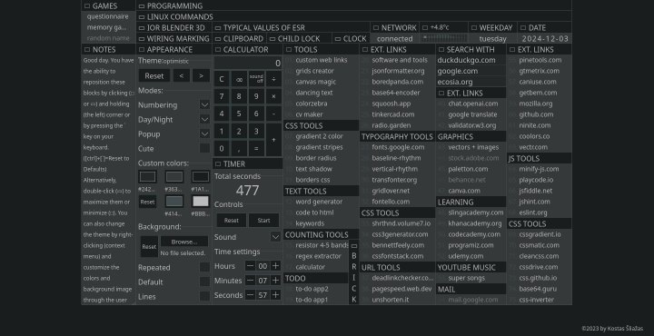

# Project K
[https://kostassliazas.github.io/project-k/]
Welcome to **Project K**! This repository contains a collection of web-based tools and applications designed to simplify various tasks and enhance productivity for developers and designers. Each tool serves a unique purpose, from generating CSS styles to managing tasks efficiently.

[Project Overview](#projects-overview) | [Screenshots](#screenshots) | [Getting Started](#getting-started) | [License](#license) | [Contact](#contact)

## Project Overview

## Screenshots

Here are some quick screenshots of the tools:




## Getting Started

Clone the repository and open the desired project folder. All tools are separate, small projects in the folder named 'tools'. Each tool can be used individually by opening the respective index.html file.

```bash
git clone https://github.com/KostasSliazas/project-k.git
```

| Project Name             | Description                                               | Quick Link                  |
|--------------------------|-----------------------------------------------------------|-----------------------------|
| **border-radius**        | A tool for generating CSS border-radius values.          | <a href="https://kostassliazas.github.io/project-k/tools/border-radius" target="_blank" rel="noopener noreferrer">Live Demo</a>             |
| **borders-gen**          | A generator for different types of CSS borders.          | <a href="https://kostassliazas.github.io/project-k/tools/borders-gen" target="_blank" rel="noopener noreferrer">Live Demo</a>             |
| **calculator**           | A simple calculator application for basic arithmetic operations. | <a href="https://kostassliazas.github.io/project-k/tools/calculator" target="_blank" rel="noopener noreferrer">Live Demo</a>         |
| **canvas-magic**         | A creative canvas tool for drawing and designing.        | <a href="https://kostassliazas.github.io/project-k/tools/canvas-magic" target="_blank" rel="noopener noreferrer">Live Demo</a>             |
| **code-to-html**         | A utility for converting code snippets into HTML format. | <a href="https://kostassliazas.github.io/project-k/tools/code-to-html" target="_blank" rel="noopener noreferrer">Live Demo</a>             |
| **colorzebra**           | A color scheme generator for web design.                 | <a href="https://kostassliazas.github.io/project-k/tools/colorzebra" target="_blank" rel="noopener noreferrer">Live Demo</a>           |
| **cvmaker**              | A simple tool for creating resumes (CVs).                | <a href="https://kostassliazas.github.io/project-k/tools/cvmaker" target="_blank" rel="noopener noreferrer">Live Demo</a>              |
| **dancing-text**         | A fun application that animates text with various effects.| <a href="https://kostassliazas.github.io/project-k/tools/dancing-text" target="_blank" rel="noopener noreferrer">Live Demo</a>         |
| **gradient-generator**   | A tool for generating beautiful gradients.                | <a href="https://kostassliazas.github.io/project-k/tools/gradient-generator" target="_blank" rel="noopener noreferrer">Live Demo</a>   |
| **gradients-two-colors** | A simple gradient generator for two colors.              | <a href="https://kostassliazas.github.io/project-k/tools/gradients-two-colors" target="_blank" rel="noopener noreferrer">Live Demo</a> |
| **grids-creator**        | A utility for creating CSS grid layouts.                 | <a href="https://kostassliazas.github.io/project-k/tools/grids-creator" target="_blank" rel="noopener noreferrer">Live Demo</a>        |
| **keywords**             | A tool for generating SEO-friendly keywords.             | <a href="https://kostassliazas.github.io/project-k/tools/keywords" target="_blank" rel="noopener noreferrer">Live Demo</a>             |
| **links**                | A basic link shortener and organizer.                    | <a href="https://kostassliazas.github.io/project-k/tools/links" target="_blank" rel="noopener noreferrer">Live Demo</a>                |
| **links-webpage**        | A web page for managing and displaying links.            | <a href="https://kostassliazas.github.io/project-k/tools/links-webpage" target="_blank" rel="noopener noreferrer">Live Demo</a>        |
| **regex-extractor**      | A tool for extracting data using regular expressions.    | <a href="https://kostassliazas.github.io/project-k/tools/regex-extractor" target="_blank" rel="noopener noreferrer">Live Demo</a>      |
| **resistor-calculator**  | A calculator for determining resistor values.            | <a href="https://kostassliazas.github.io/project-k/tools/resistor-calculator" target="_blank" rel="noopener noreferrer">Live Demo</a>  |
| **text-shadow**          | A tool for generating CSS text shadows.                  | <a href="https://kostassliazas.github.io/project-k/tools/text-shadow" target="_blank" rel="noopener noreferrer">Live Demo</a>          |
| **todo-app**             | A simple to-do list application.                          | <a href="https://kostassliazas.github.io/project-k/tools/todo-app" target="_blank" rel="noopener noreferrer">Live Demo</a>             |
| **todo-app-1**           | An enhanced version of the to-do list application.       | <a href="https://kostassliazas.github.io/project-k/tools/todo-app-1" target="_blank" rel="noopener noreferrer">Live Demo</a>           |
| **word-generator**       | A tool for generating random words.                       | <a href="https://kostassliazas.github.io/project-k/tools/word-generator" target="_blank" rel="noopener noreferrer">Live Demo</a>       |

| Project Name             | Description                                               | Quick Link                  |
|--------------------------|-----------------------------------------------------------|-----------------------------|
| **Memory Game2**         | A fun memory matching game to improve memory skills.       | <a href="https://kostassliazas.github.io/project-k/tools/memory-game2" target="_blank" rel="noopener noreferrer">Live Demo</a>               |
| **Questionnaire**        | A tool for creating customizable questionnaires.           | <a href="https://kostassliazas.github.io/project-k/tools/questionnaire" target="_blank" rel="noopener noreferrer">Live Demo</a>              |
| **Roulette**             | A simple roulette game for fun and entertainment.          | <a href="https://kostassliazas.github.io/project-k/tools/roulette" target="_blank" rel="noopener noreferrer">Live Demo</a>                   |

## Contact

For any inquiries or suggestions, feel free to contact me:

Kostas Šliažas
[kostazzz@balticum-tv.lt]
[https://kostassliazas.github.io/]

## Technologies Used

This project is built using the following technologies:

- **HTML**: For structuring the web applications.
- **CSS**: For styling and layout design.
- **JavaScript(Vanilla)**: For implementing core functionalities without any frameworks.
- **Vue.js**: A progressive JavaScript framework for building user interfaces.

## License

This project is licensed under the MIT License. See the LICENSE file for details.

## Disclaimer

Please note that some of the tools included in this project are not originally created by me. They are utilized to enhance functionality and provide additional features. I acknowledge and appreciate the efforts of the original creators of these tools.

Please note that the external links included in this project are not owned or maintained by me. They are used for reference and convenience to enhance the functionality of the tools. I do not take responsibility for the content or availability of these external resources.
